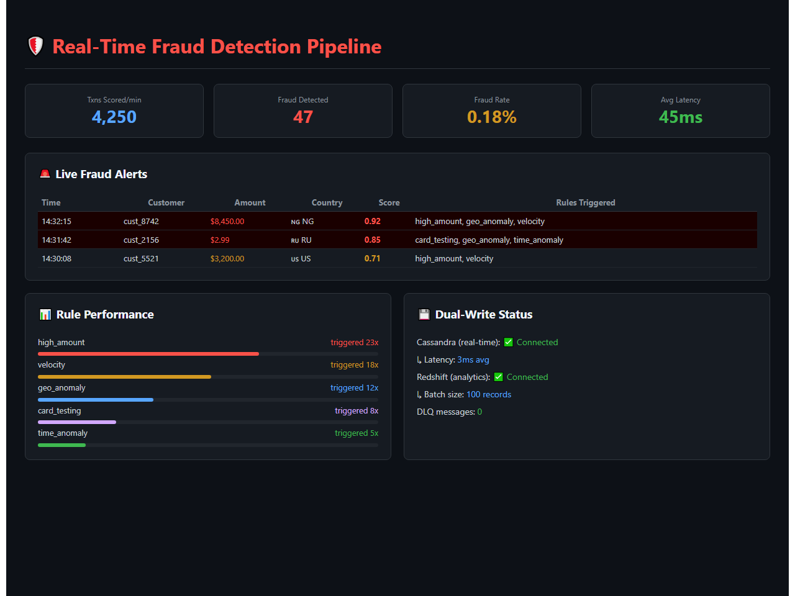
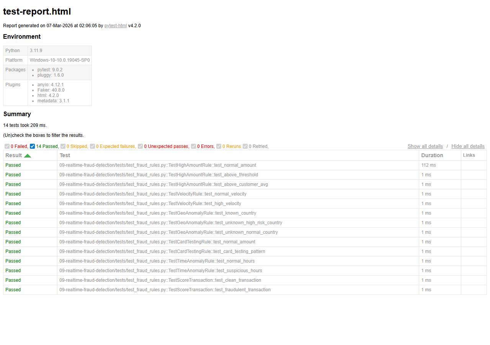

# Real-Time Fraud Detection Streaming Pipeline

[](https://www.python.org/downloads/)
[](https://kafka.apache.org/)
[](https://spark.apache.org/)


## Demo



*Live fraud detection dashboard showing transaction scoring, fraud alerts with triggered rules, rule performance bars, and dual-write status*

## Architecture

```
Transaction     +---------+    +------------------+    +-----------+
  Sources  ---->|  Kafka  |--->|  PySpark         |--->| Cassandra |
                | (Ingest)|    |  Streaming       |    | (Real-time|
                +---------+    |  Fraud Scoring   |    |  Lookups) |
                               +--------+---------+    +-----------+
                                        |
                           +------------+------------+
                           |            |            |
                    +------v---+  +-----v---+  +-----v----+
                    | Redshift |  |   DLQ   |  | Grafana  |
                    |(Analytics|  |(Failed) |  |Dashboard |
                    |  Store)  |  |         |  | + Alerts |
                    +----------+  +---------+  +----------+
```

## Features

- Real-time transaction scoring with multi-rule fraud engine
- Rule-based fraud detection: velocity checks, amount anomalies, geo-impossibility, card testing patterns
- PySpark Structured Streaming with stateful processing
- Dual-write: Cassandra (real-time lookups) + Redshift (analytics)
- Dead Letter Queue (DLQ) for malformed/failed records
- Grafana dashboard with fraud rate monitoring and alerting
- Full Docker Compose stack (Kafka, Spark, Cassandra, Grafana)

## Fraud Detection Rules

| Rule | Description | Weight |
|------|-------------|--------|
| High Amount | Transaction > $5,000 or > 3x customer average | 0.3 |
| Velocity | > 5 transactions in 10 minutes | 0.25 |
| Geo Anomaly | Transaction from new country | 0.2 |
| Card Testing | Multiple small amounts (<$5) in 5 minutes | 0.15 |
| Time Anomaly | Transaction between 2-5 AM local time | 0.1 |

## Quick Start

```bash
cp .env.example .env
docker-compose up -d

# Generate synthetic transactions
python -m producers.transaction_generator

# Submit Spark streaming job
docker exec spark-master spark-submit \
  --packages org.apache.spark:spark-sql-kafka-0-10_2.12:3.5.0 \
  /app/streaming/fraud_processor.py
```

## Project Structure

```
|-- config/                  # Settings and rule configurations
|-- producers/               # Transaction generator + Kafka producer
|-- streaming/               # PySpark fraud scoring engine
|-- rules/                   # Fraud detection rule implementations
|-- sinks/                   # Cassandra + Redshift writers
|-- dbt_project/             # Analytics models on Redshift
|-- grafana/                 # Dashboard provisioning
|-- docker-compose.yml       # Full local stack
`-- tests/                   # Unit tests
```


## Test Results

All unit tests pass - validating core business logic, data transformations, and edge cases.



**14 tests passed** across 6 test suites:
- TestHighAmountRule - normal/threshold/customer-avg triggers
- TestVelocityRule - transaction frequency detection
- TestGeoAnomalyRule - known/high-risk/unknown country scoring
- TestCardTestingRule - small transaction pattern detection
- TestTimeAnomalyRule - suspicious hours (2-5 AM) flagging
- TestScoreTransaction - clean vs fraudulent weighted scoring

## Maintainer

**Siddarth Mally**
Cybersecurity Analyst
Email: siddarthmally38@gmail.com
LinkedIn: https://www.linkedin.com/in/siddarth-mally-451565242/

Siddarth is a Cybersecurity professional with over 4 years of experience in GRC, Third-Party Risk Management, and security due diligence. This project represents an intersection of data engineering and security governance, focusing on building resilient, real-time systems for fraud detection and risk mitigation in highly regulated environments.